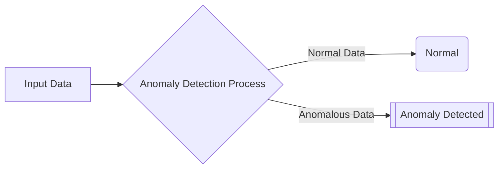
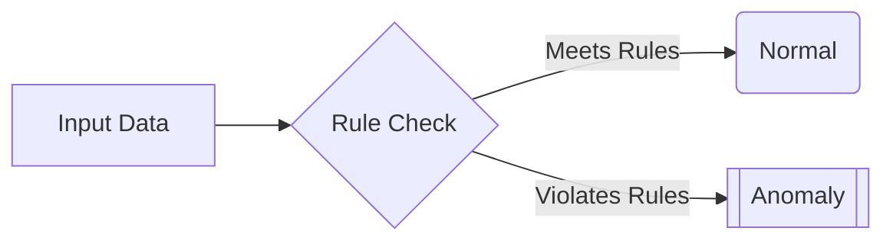
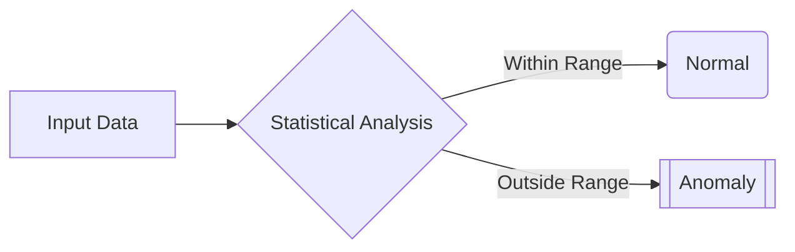
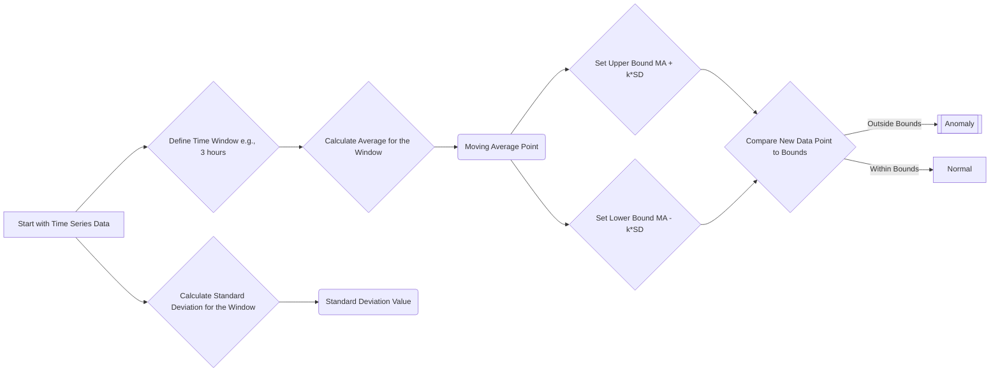
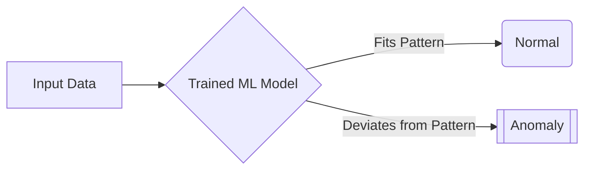
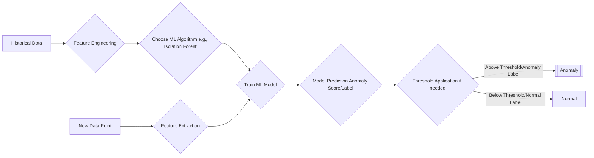
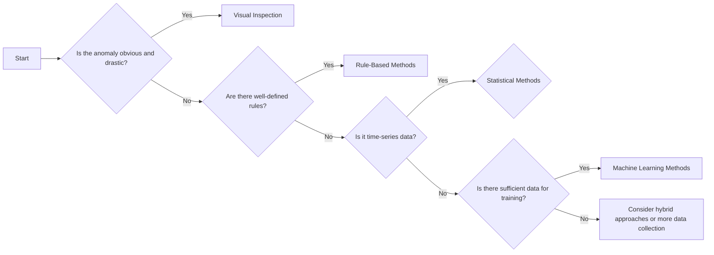
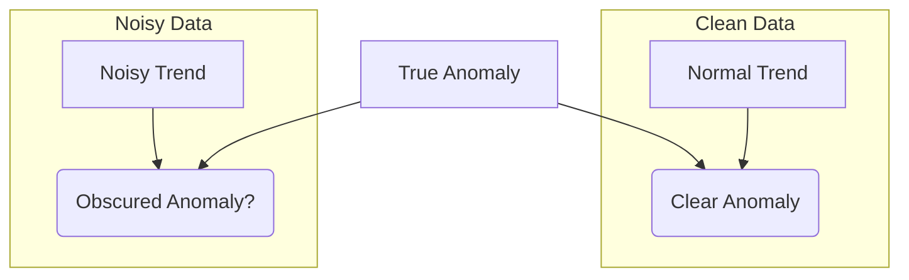

# Anomaly Detection

## Identifying the Unusual

- **What is an Anomaly?**
  - An anomaly is a data point or event that deviates significantly from expected patterns.
  - Anomalies can indicate errors, fraud, or emerging trends.
- **Examples of anomalies:**
  - `Web Traffic:` Sudden increases or decreases in website clicks.
  - `Healthcare:` Unusual vital sign readings.
  - `Manufacturing:` Unexpected changes in equipment performance.

## Use Cases for Anomaly Detection

- **Problem Detection:** Identify issues like website outages using unusual data patterns.
- **Fraud Detection:** Detect fraudulent activities such as unusual purchase patterns or unauthorized access attempts.
- **Performance Optimization:** Improve system performance by pinpointing deviations.
- **Business Intelligence:** Spot unusual patterns that may indicate new opportunities.

## Practical Exercises

- Explore the practical demonstration in the [Jupyter notebook](./35-anomaly_detection_demo.ipynb).
- Test your understanding with the [challenge exercise](./37-anomaly_detection_challenge.ipynb).

## Anomaly Detection Methods

- The suitability of each method depends on the nature of the anomalies.
- Methods range from basic visual inspection to complex machine learning techniques.

### Visual Inspection

- Data plots can reveal large, obvious anomalies.
- Example: A sudden spike in 'Page Views' on a time-series plot.
- 
- Visual inspection is not effective with subtle anomalies or large, complex datasets.

### Rule-Based Methods

- Use predefined rules to detect anomalies.
- Example: Flag purchases exceeding a set threshold or purchases from unusual locations.
- Rule-based methods are simple but may lack flexibility, and can be hard to manage as rule complexity increases.

### Statistical Methods

- Use statistical measures to establish a normal range and detect outliers.
- Useful for subtle deviations, especially in time-series data.
- Example: Moving averages and standard deviations are used to define bounds.

- A `moving average`
  - smooths data over a given time window, revealing baseline trends.
  - The time window size affects sensitivity: longer windows reduce short-term anomaly detection.
- `Standard deviation`
  - measures typical data variation around the moving average.
  - Anomalies are flagged if they fall outside a specified number of standard deviations from the average.
- 
- Graph shows hourly website clicks with a 3-hour moving average, and upper/lower bounds based on standard deviation. Red circles highlight statistical anomalies.

### Machine Learning Methods

- Employ machine learning algorithms to learn data patterns and detect deviations.
- Effective for detecting complex, structural anomalies that do not adhere to a predefined range.
- Example: Isolation Forest algorithm detects anomalies as outliers through random data partitioning.

- Isolation Forest algorithm:
  - Randomly partitions data.
  - Isolates anomalies faster than normal data points.
  - Outputs an anomaly score for each data point; negative scores indicate anomalies.
  - The output of the isolation forest model is a binary label for each data point, indicating if it is an outlier or not.
  - Isolation forest outputs an anomaly score for each data point. Negative scores indicate anomalies, with larger negative values implying a higher likelihood of being an outlier, and positive scores indicate normal behavior.
  - This approach identifies data points that deviate from the learned norm and are easier to isolate.
- 
- The graph shows Isolation Forest anomaly detection on the same web clicks data.
- Other algorithms such as One-class SVM or autoencoders can also be used.
- AI/ML methods provide an alternative to identify structural deviations without explicitly defining thresholds.

## Method Comparison

| Method                       | Description                                                                        | Advantages                                                                                                    | Disadvantages                                                                                   | Best Use Case                                                                                                                  |
| ---------------------------- | ---------------------------------------------------------------------------------- | ------------------------------------------------------------------------------------------------------------- | ----------------------------------------------------------------------------------------------- | ------------------------------------------------------------------------------------------------------------------------------ |
| **Visual Inspection**        | Manual examination of data plots for deviations.                                   | Simple, effective for obvious anomalies.                                                                      | Subjective, unreliable for subtle anomalies or complex data.                                    | Initial assessment, extreme deviations.                                                                                        |
| **Rule-Based Methods**       | Uses predefined rules to identify outliers.                                        | Straightforward implementation, good if normal data conditions are clear.                                     | Inflexible, difficult to manage as rules complexity increases.                                  | Situations with defined conditions and limited dataset size.                                                                   |
| **Statistical Methods**      | Uses statistical measures to find outliers using standard deviations.              | Easy to understand, useful with time series data.Detects deviations based on central tendencies and variance. | Sensitivity is parameter dependent, might miss structural anomalies.                            | Time-series data, with anomalies as deviations from a baseline.                                                                |
| **Machine Learning Methods** | Uses ML algorithms like Isolation Forest to learn patterns and identify anomalies. | Identifies structural outliers, adapts to new patterns, no manual thresholds.                                 | Computationally expensive, needs significant data, output may be hard to interpret and explain. | Complex datasets where normal data is not defined by simple thresholds, and there are structural differences in the anomalies. |

## Challenges in Anomaly Detection

1. **Class Imbalance:** Anomalies are rare, requiring specialized handling.
2. **Interpretability:** Explaining ML-based anomaly detection results to non-technical stakeholders can be difficult.
3. **Evolving Norms:** Data patterns change, requiring adaptive models.
4. **Data Quality:** Noise or missing data can obscure real anomalies.

## Conclusion

- Method selection depends on dataset size, anomaly magnitude, and computational resources.
- A combined approach with multiple methods can enhance detection rates.
