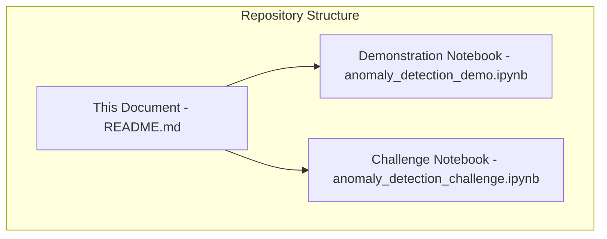
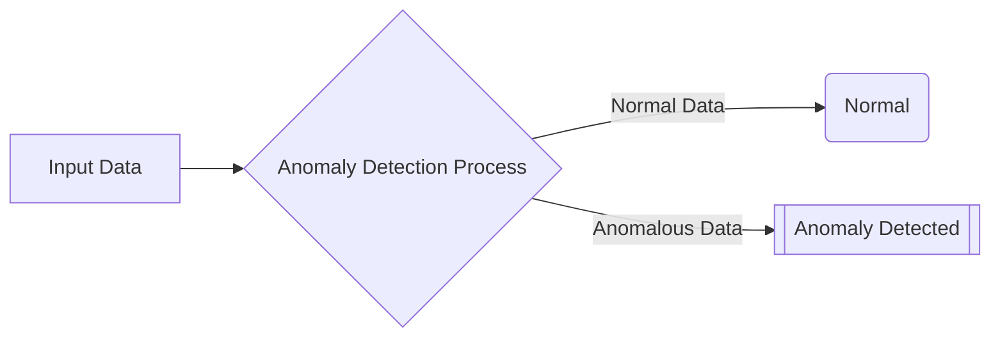
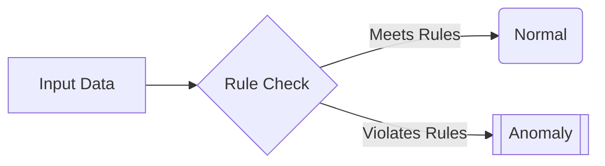
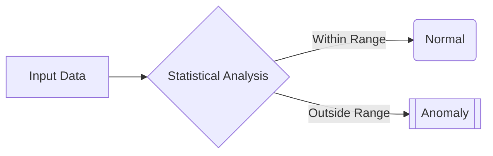
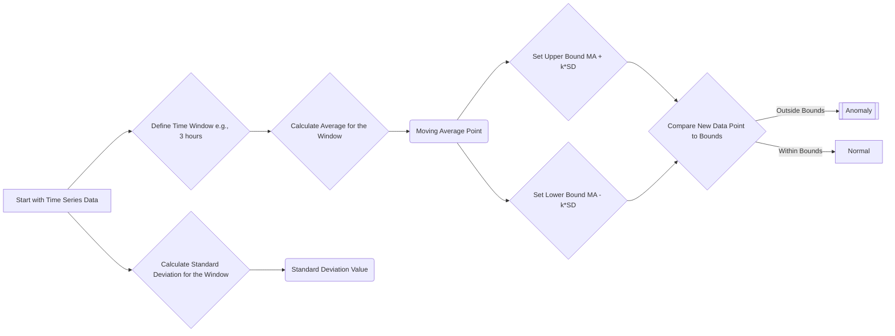
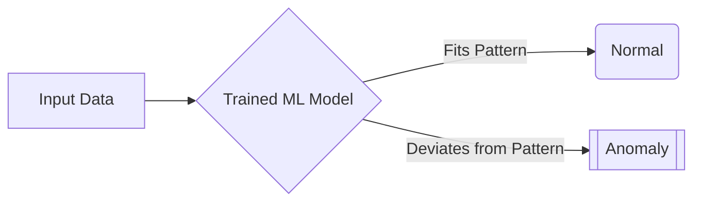
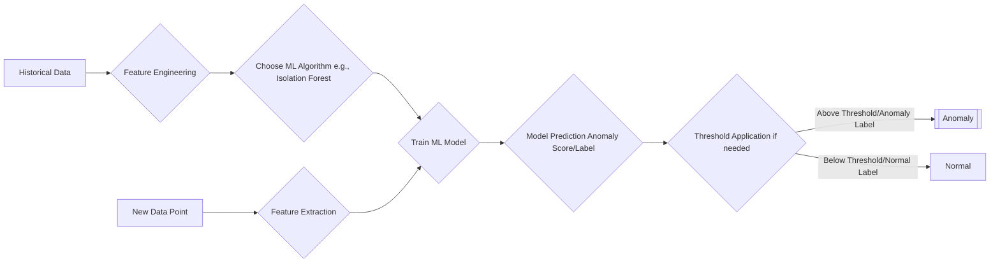
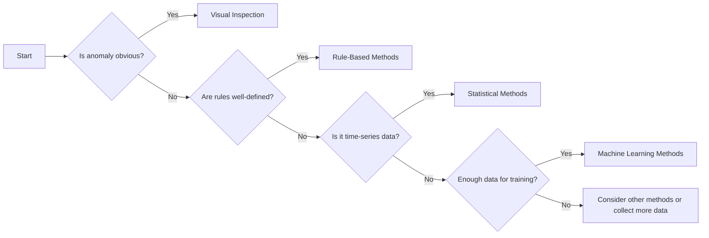
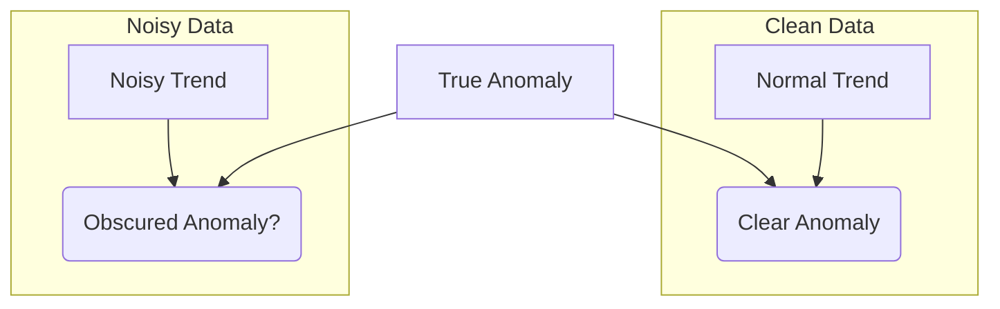

# Anomaly Detection Repository

## About this Repository

This repository provides an introduction to anomaly detection with practical exercises. It includes conceptual explanations, a hands-on demonstration, and a challenge lab.

## No installation needed

You can use this current document to understand the Anomaly Detection topic.

[Then run the demo and challenge notebooks directly in your browser by clicking this link](https://mybinder.org/v2/gh/kanad13/anomaly_detection_demo/HEAD).

**This eliminates the need for local setup.**

## Repository Contents

- **Conceptual Overview (This Document):** Explains the core ideas behind anomaly detection and different methods.
- **Demonstration Notebook (anomaly_detection_demo.ipynb):** Provides a practical, runnable example of anomaly detection in action.
- **Challenge Notebook (anomaly_detection_challenge.ipynb):** Offers an exercise to apply your knowledge and skills.

## Introduction to Anomaly Detection

- **What is an Anomaly?**
  - An anomaly is a data point or event that deviates significantly from expected patterns.
  - Anomalies can indicate errors, fraud, or emerging trends.
- **Examples of anomalies:**
  - `Web Traffic:` Sudden increases or decreases in website clicks.
  - `Healthcare:` Unusual vital sign readings.
  - `Manufacturing:` Unexpected changes in equipment performance.

## Use Cases for Anomaly Detection

- **Problem Detection:** Identify issues like website outages using unusual data patterns.
- **Fraud Detection:** Detect fraudulent activities such as unusual purchase patterns or unauthorized access attempts.
- **Performance Optimization:** Improve system performance by pinpointing deviations.
- **Business Intelligence:** Spot unusual patterns that may indicate new opportunities.

## Anomaly Detection Methods

- The suitability of each method depends on the nature of the anomalies.
- Methods range from basic visual inspection to complex machine learning techniques.

### Visual Inspection

- Data plots can reveal large, obvious anomalies.
- Example: A sudden spike in 'Page Views' on a time-series plot.
- 
- Visual inspection is not effective with subtle anomalies or large, complex datasets.

### Rule-Based Methods

- Use predefined rules to detect anomalies.
- Example: Flag purchases exceeding a set threshold or purchases from unusual locations.
- Rule-based methods are simple but may lack flexibility, and can be hard to manage as rule complexity increases.

### Statistical Methods

- Use statistical measures to establish a normal range and detect outliers.
- Useful for subtle deviations, especially in time-series data.
- Example: Moving averages and standard deviations are used to define bounds.

- A `moving average`
  - smooths data over a given time window, revealing baseline trends.
  - The time window size affects sensitivity: longer windows reduce short-term anomaly detection.
- `Standard deviation`
  - measures typical data variation around the moving average.
  - Anomalies are flagged if they fall outside a specified number of standard deviations from the average.
- 
- Graph shows hourly website clicks with a 3-hour moving average, and upper/lower bounds based on standard deviation. Red circles highlight statistical anomalies.

### Machine Learning Methods

- Employ machine learning algorithms to learn data patterns and detect deviations.
- Effective for detecting complex, structural anomalies that do not adhere to a predefined range.
- Example: Isolation Forest algorithm detects anomalies as outliers through random data partitioning.

- Isolation Forest algorithm:
  - Randomly partitions data.
  - Isolates anomalies faster than normal data points.
  - Outputs an anomaly score for each data point; negative scores indicate anomalies.
  - The output of the isolation forest model is a binary label for each data point, indicating if it is an outlier or not.
  - Isolation forest outputs an anomaly score for each data point. Negative scores indicate anomalies, with larger negative values implying a higher likelihood of being an outlier, and positive scores indicate normal behavior.
  - This approach identifies data points that deviate from the learned norm and are easier to isolate.
- 
- The graph shows Isolation Forest anomaly detection on the same web clicks data.
- Other algorithms such as One-class SVM or autoencoders can also be used.
- AI/ML methods provide an alternative to identify structural deviations without explicitly defining thresholds.

## Method Comparison

| Method                       | Description                                                                  | Advantages                                                       | Disadvantages                                                          | Best Use Case                                                                |
| ---------------------------- | ---------------------------------------------------------------------------- | ---------------------------------------------------------------- | ---------------------------------------------------------------------- | ---------------------------------------------------------------------------- |
| **Visual Inspection**        | Manually reviewing data plots for outliers.                                  | Simple, good for obvious outliers.                               | Subjective, not for subtle anomalies or large data.                    | Initial review, very clear deviations.                                       |
| **Rule-Based Methods**       | Using defined rules to find anomalies.                                       | Easy to implement if normal conditions are clear.                | Inflexible, hard to manage with many complex rules.                    | Defined conditions, smaller datasets.                                        |
| **Statistical Methods**      | Finding outliers using statistical measures like standard deviation.         | Understandable, useful for time series data. Detects deviations. | Sensitivity depends on settings, may miss structural anomalies.        | Time-series data, deviations from a norm.                                    |
| **Machine Learning Methods** | Using algorithms like Isolation Forest to learn patterns and find anomalies. | Finds structural outliers, adapts, no manual thresholds needed.  | Computationally intensive, needs data, results can be hard to explain. | Complex data, structural differences in anomalies, sufficient training data. |

## Challenges

1. **Class Imbalance:** Anomalies are rare, requires special handling.
2. **Interpretability:** Explaining ML results can be difficult.
3. **Evolving Norms:** Data patterns change, models need to adapt.
4. **Data Quality:** Noise or missing data can hide anomalies.

## Conclusion

- Method choice depends on data size, anomaly severity, and resources.
- Combining methods can improve detection.
